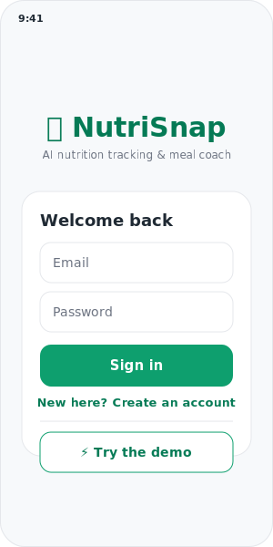
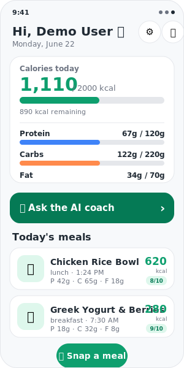
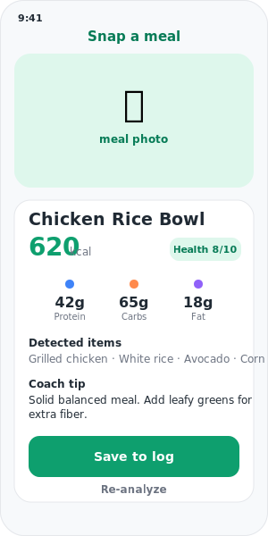
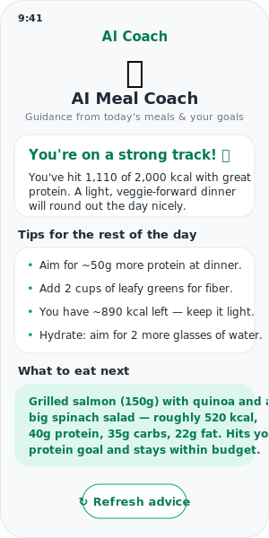

# 🥗 NutriSnap: AI Nutrition Tracker & Meal Coach (Mobile)

> A modern **AI-powered nutrition tracking mobile application** built with **React Native (Expo) + TypeScript**, designed to help users log meals, understand nutrition intake, and receive personalized AI-driven meal coaching in real time.

NutriSnap demonstrates how **AI, mobile UX, and real-world health data workflows** can be combined to build a production-ready consumer application with strong scalability and user engagement patterns.

---

# ⚡ Working Demo (FastAPI + Claude)

This repo includes a **fully working backend and a minimal Expo client**:

* **FastAPI backend** (`backend/`) — JWT auth, SQLAlchemy (SQLite by default, Postgres-ready), meal logging, and local image storage, exposed as a REST API. Runs via `uvicorn` or `docker compose` (with Postgres).
* **AI nutrition analysis** — `POST /meals/analyze` sends meal photos to the **Claude API** (vision + structured JSON) for calorie/macro estimation
* **AI Meal Coach** — `GET /coach` asks **Claude** for personalized "what to eat next" guidance based on the day's logged meals and goals
* **Expo client** (`app/`) — React Native + TypeScript app: auth (+ one-tap demo), dashboard, camera→analyze→log flow, AI coach, and a goals editor

👉 **See [SETUP.md](SETUP.md)** for end-to-end setup: run the backend, then the app.

---

# 📱 Screenshots

<table>
  <tr>
    <td></td>
    <td></td>
    <td></td>
    <td></td>
  </tr>
  <tr>
    <td align="center"><sub>Sign in / demo</sub></td>
    <td align="center"><sub>Daily dashboard</sub></td>
    <td align="center"><sub>AI photo analysis</sub></td>
    <td align="center"><sub>AI Meal Coach</sub></td>
  </tr>
</table>

> These are UI mockups using the app's real palette/layout. To swap in real
> device captures, see [docs/screenshots/](docs/screenshots/README.md).

# 🚀 Project Overview

NutriSnap is a mobile-first nutrition assistant that allows users to:

* 📸 Capture meals using camera or upload images
* 🧠 Automatically detect food items using AI
* 🔢 Estimate calories and macronutrients
* 📊 Track daily nutrition intake and goals
* 🤖 Receive AI-powered meal recommendations
* 📅 Maintain a daily/weekly health history

The app focuses on **simplicity for users** and **intelligence under the hood**, simulating a real-world consumer health product.

---

# 🎯 Key Objectives

This project was built to demonstrate:

* AI-native mobile app development workflows
* Practical use of LLMs in consumer applications
* Clean mobile architecture using React Native + TypeScript
* Scalable app structure suitable for production
* Real-world product thinking (health & wellness domain)
* Fast iteration using AI-assisted development tools

---

# 🧠 Core Features

## 📸 1. Smart Meal Capture

Users can:

* Take a photo of food
* Upload an image from gallery

The system then:

* Detects food items
* Classifies meal type
* Sends data to AI nutrition engine

---

## 🤖 2. AI Nutrition Analysis Engine

The AI layer processes input and returns:

* Food identification (multi-item detection)
* Estimated calories
* Protein / carbs / fat breakdown
* Health score (balanced meal indicator)

> Powered by LLM + structured prompt engineering for nutrition estimation

---

## 📊 3. Daily Nutrition Dashboard

* Calorie progress bar
* Macro breakdown visualization
* Meal timeline (breakfast, lunch, dinner, snacks)
* Goal tracking (weight loss / maintenance / gain)

---

## 🍽️ 4. AI Meal Coach

Users receive:

* Personalized meal suggestions
* Health improvement tips
* “What should I eat next?” recommendations
* Smart substitutions (e.g., healthier alternatives)

---

## 📅 5. History & Insights

* Daily / weekly / monthly tracking
* Nutrition trend analysis
* Habit insights (e.g., high sugar intake patterns)
* Exportable summaries

---

# 🏗️ System Architecture

```text id="nutrisnap-arch"
Mobile App (React Native - Expo)
        │
        ├── UI Layer
        │   ├── Screens (Home, Camera, Dashboard)
        │   ├── Components (Cards, Charts, Inputs)
        │
        ├── State Management Layer
        │   ├── Hooks (useNutrition, useMeals)
        │   ├── Context (User, Goals)
        │
        ├── AI Service Layer
        │   ├── Food Recognition API (Vision/LLM)
        │   ├── Nutrition Estimation Engine
        │   ├── Meal Recommendation Engine
        │
        ├── Data Layer
        │   ├── Local Storage (AsyncStorage)
        │   ├── Optional Backend Sync (REST API)
        │
        └── Analytics Layer
            ├── Nutrition tracking metrics
            ├── User behavior events
```

---

# ⚙️ Tech Stack

## 📱 Mobile

* React Native (Expo)
* TypeScript
* React Navigation
* Expo Camera / Image Picker
* Reanimated (UI interactions)

## 🧠 AI Layer

* OpenAI / Claude API
* Prompt-engineered nutrition estimator
* Structured JSON response parsing
* Optional vision model integration

## 📊 Data & Storage

* AsyncStorage (local-first design)
* Optional backend (Node.js / FastAPI)
* RESTful API design

## 🎨 UI / UX

* Clean health-focused UI design
* Card-based dashboard
* Minimal friction meal logging flow
* Mobile-first interaction patterns

---

# 🧱 Project Structure

```text id="nutrisnap-structure"
NutriSnap/
│
├── src/
│   ├── assets/
│   ├── components/
│   ├── screens/
│   │   ├── HomeScreen.tsx
│   │   ├── CameraScreen.tsx
│   │   ├── DashboardScreen.tsx
│   │   ├── MealDetailScreen.tsx
│   │
│   ├── services/
│   │   ├── aiNutritionService.ts
│   │   ├── mealRecognitionService.ts
│   │
│   ├── hooks/
│   │   ├── useMeals.ts
│   │   ├── useNutrition.ts
│   │
│   ├── context/
│   │   ├── UserContext.tsx
│   │
│   ├── utils/
│   │   ├── calorieCalculator.ts
│   │   ├── macrosParser.ts
│
├── App.tsx
├── package.json
└── README.md
```

---

# 🧠 AI Design Approach

NutriSnap uses **structured AI outputs** instead of raw text.

### Example AI Output Schema:

```json id="ai-schema"
{
  "meal": "Chicken Rice Bowl",
  "calories": 620,
  "macros": {
    "protein": 42,
    "carbs": 65,
    "fat": 18
  },
  "healthScore": 8,
  "recommendation": "Add more greens for fiber balance"
}
```

This ensures:

* Predictable UI rendering
* Safe data parsing
* Scalable AI integration

---

# 🔐 Key Design Principles

## 1. Mobile-first simplicity

* One-tap meal logging
* Minimal user friction

## 2. AI as a co-pilot, not a replacement

* Users stay in control
* AI provides suggestions, not commands

## 3. Structured intelligence

* All AI outputs are schema-driven
* No free-text dependency in UI layer

## 4. Offline-first UX mindset

* Core tracking works without backend dependency

---

# 📈 Scalability Considerations

* Backend-ready modular architecture
* API abstraction for AI providers
* Future support for:

  * wearable integration (Apple Health / Google Fit)
  * barcode scanning
  * subscription-based meal plans
  * personalized nutrition models

---

# 🤖 AI Usage in Development

This project was accelerated using AI-assisted workflows:

* UI scaffolding via AI tools
* Prompt engineering for nutrition logic
* API response structuring
* Rapid iteration of mobile screens
* Automated documentation generation

---

# 🧪 Future Improvements

* Food barcode scanning
* Real-time object detection (on-device ML)
* Personalized diet plans (AI coach evolution)
* Social features (meal sharing)
* Gamification (streaks, badges)
* Integration with fitness tracking APIs

---
